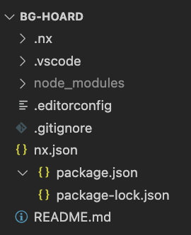

# 💻 Lab 1 - generate an empty workspace

###### ⏰ &nbsp;Estimated time: 5-10 minutes

## 📚 Learning outcomes:

- **Understand how to bootstrap a new Nx workspace**

#### 📲 After this workshop, your file structure should look similar to this:

  
File structure

  

## 🏋️‍♀️ Steps:

1. Generate an empty Nx workspace for a fictional company called "The Board Game Hoard"

2. The workspace name should be `bg-hoard`

3. When prompted, select:
   - `None` as Stack (we will create apps manually)
   - An `Integrated` workspace layout
   - And `skip` configuring a `CI Provider` and `Remote Caching` for now (we'll set those up in a later lab)

---

🎓&nbsp;&nbsp;If you get stuck, check out [the solution](SOLUTION.md)

---

[➡️ &nbsp;Next lab ➡️](../lab2/LAB.md)
