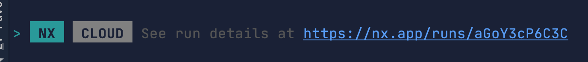
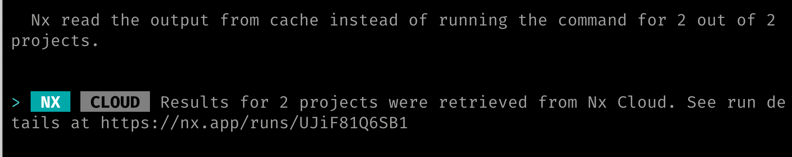

# 🔌 Lab 16 - Distributed caching

###### ⏰ Estimated time: 10 minutes
<<<<<<< HEAD
=======

>>>>>>> ebb6ada (feat: add day 2 labs (#6))
<br />

## 📚 Learning outcomes:

- **Understand the difference between local and distributed caching**
- **Learn how to add NxCloud and enable distributed on an existing Nx workspace**
<<<<<<< HEAD
<br /><br /><br />

## 🏋️‍♀️ Steps :

1. Earlier in the workshop, we discussed about Nx's [local caching](https://nx.dev/latest/angular/workspace/computation-caching#computation-caching) 
capabilities. Let's enable distributed caching.

   ```
   yarn add @nrwl/nx-cloud
   nx generate @nrwl/nx-cloud:init
   ```
   
   
   <br /> <br />
   
=======
  <br /><br /><br />

## 🏋️‍♀️ Steps :

1. Earlier in the workshop, we discussed about Nx's [local caching](https://nx.dev/latest/angular/workspace/computation-caching#computation-caching)
   capabilities. Let's enable distributed caching.

   ```
   nx connect-to-nx-cloud
   ```

   
   <br /> <br />

>>>>>>> ebb6ada (feat: add day 2 labs (#6))
2. Inspect the changes added in `nx.json` - especially the access token. We'll explain that more in a bit!
   <br /> <br />
3. **Very important:** Make sure, at this stage, you commit and push your changes:

<<<<<<< HEAD
    ```
    # make sure you're on master
    git checkout master
    git add . && git commit -m "add nx cloud"
    git push origin master
    ```
    <br />

4. Run a build: `nx run-many --target=build --all`
    
    🕑 Watch the process in the terminal - it might take a few seconds...
    <br /> <br />
    
5. You'll see a link at the end, let's see what's there:

    
    
    We'll talk more about these links later!
    <br /> <br />
    
6. Try to build all projects again: `nx run-many --target=build --all`
    
    ⚡ It should finish **much quicker** this time - because it just pulled from the local cache!
    <br /> <br />
    
7. Let's try something different now - in a different folder on your machine, let's try and do a **fresh** of your repository:

    ```
    # go into a new folder
    cd ..
    # clone your repo again
    git clone git@github.com:<your-username>/<your-repo>.git test-distributed-caching
    cd test-distributed-caching
    # install dependencies
    yarn
    ```
    <br />

8. In your new instance, let's try and build again: `nx run-many --target=build --all`

    ⚡ It should be almost instant...
    <br /> <br />

9. **But how?** You have no local cache: we just did a fresh pull of the repository. 

    Check your terminal output - you should see this message: 

    
    
    That means that instead of rebuilding locally again, we just pulled from the distributed cache. 
    <br /> <br />
    
=======
   ```
   # make sure you're on master
   git checkout master
   git add . && git commit -m "add nx cloud"
   git push origin master
   ```

   <br />

4. Run a build: `nx run-many --target=build --all`

   🕑 Watch the process in the terminal - it might take a few seconds...
   <br /> <br />

5. You'll see a link at the end, let's see what's there:

   

   We'll talk more about these links later!
   <br /> <br />

6. Try to build all projects again: `nx run-many --target=build --all`

   ⚡ It should finish **much quicker** this time - because it just pulled from the local cache!
   <br /> <br />

7. Let's try something different now - in a different folder on your machine, let's try and do a **fresh** of your repository:

   ```
   # go into a new folder
   cd ..
   # clone your repo again
   git clone git@github.com:<your-username>/<your-repo>.git test-distributed-caching
   cd test-distributed-caching
   # install dependencies
   yarn
   ```

   <br />

8. In your new instance, let's try and build again: `nx run-many --target=build --all`

   ⚡ It should be almost instant...
   <br /> <br />

9. **But how?** You have no local cache: we just did a fresh pull of the repository.

   Check your terminal output - you should see this message:

   

   That means that instead of rebuilding locally again, we just pulled from the distributed cache.
   <br /> <br />

>>>>>>> ebb6ada (feat: add day 2 labs (#6))
10. Let's try a different command - in the same folder you are in, try to run:

    ```
    nx run-many --target=lint --all
    ```
<<<<<<< HEAD
    
    🕑 It should start the linting work, and take a few seconds...
    <br /> <br />

10. Now let's go back to our main workshop repository and run:
=======

    🕑 It should start the linting work, and take a few seconds...
    <br /> <br />

11. Now let's go back to our main workshop repository and run:
>>>>>>> ebb6ada (feat: add day 2 labs (#6))

    ```
    nx run-many --target=lint --all
    ```
<<<<<<< HEAD
    
=======

>>>>>>> ebb6ada (feat: add day 2 labs (#6))
    ⚡ It should pull again from the NxCloud cache...This is even works across laptops! CI will use it as well!
    <br /> <br />

---

[➡️ Next lab ➡️](../lab17/LAB.md)
