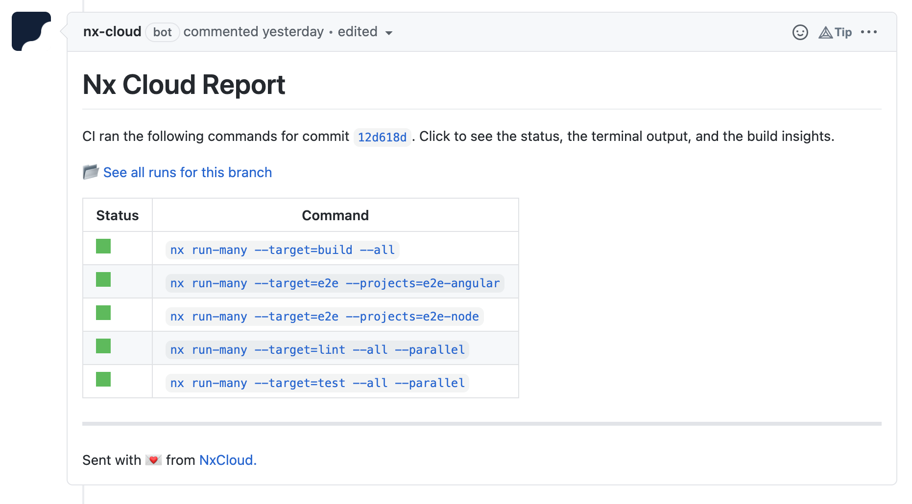
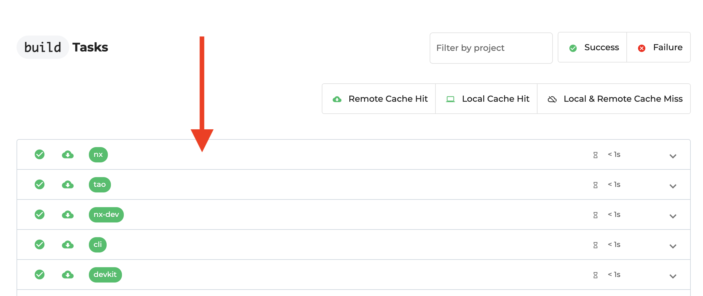
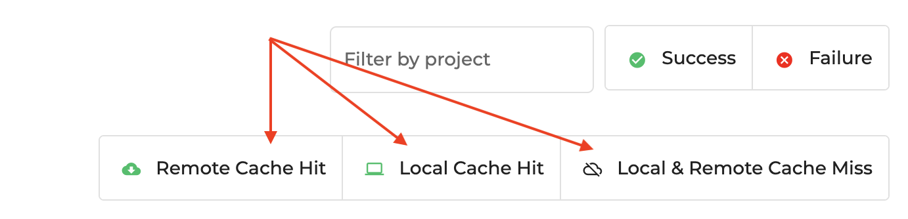

# 🔍 Lab 17 - NxCloud GitHub bot

###### ⏰ &nbsp;Estimated time: 10 minutes

## 📚 Learning outcomes:

- **Explore the NxCloud Run-Detail pages**
- **Configure the NxCloud bot to get easy to read reports on the Nx checks performed during CI**
<br />

## 🏋️‍♀️ Steps :

1. **Enable the NxCloud GitHub bot** on your GitHub repository: [https://github.com/apps/nx-cloud](https://github.com/apps/nx-cloud)
<br />

2. Switch to a new branch: `git checkout -b nxcloud-bot`
<br />

4. Make a change (add a `console.log("...")` somewhere in `apps/store/src/app/app.tsx`) in the store app (so that it will trigger our affected commands in CI).

<br />

5. Commit everything and push your branch
<br />

6. Make a PR on GitHub
<br />

7. Once the checks finish you should see something similar to this:

   
<br />

8. Click on one of the "failed" commands (if any). On the "Run Details" page, click on one of the projects and inspect the terminal output:

   

   🔥 Rather than reading through CI logs, you can use this view to filter to the failed projects and inspect the failure reason scoped to that project.
<br />

9. Have a look at the "Cache Hit" and "Cache Miss" filters. What do you think they do?

   
<br />

10. Finally, you should see a "Claim workspace" button at the top - it's a good idea to do that at this stage. We'll explain more about that in a bit!
<br />

11. Merge your PR into master and pull latest locally:

    ```
    git checkout master
    git pull
    ```
<br />

---

[➡️ &nbsp;Next lab ➡️](../lab18/LAB.md)
