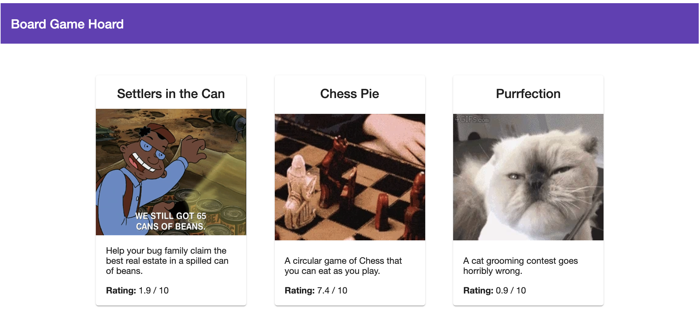

# 🧲 Lab 20 Alternative - Mock Store

###### ⏰ &nbsp;Estimated time: 5 minutes

## 🏋️‍♀️ Steps :

For now, our `store` project has no API when it is deployed. Hence, it is only displaying the header.

1. If you removed your `fake-api/index.ts` from the `store`, let's [re-add it](https://github.com/nrwl/nx-workshop/blob/master/examples/lab2/apps/store/src/fake-api/index.ts)
<br />

2. Import it in your `apps/store/src/app/app.tsx`

   <details>
   <summary>🐳 &nbsp;&nbsp;Hint</summary>

   ```typescript
    import { getAllGames } from '../fake-api/index';

    export const App = () => {

    return (
      <>
        <Header title="Board Game Hoard" />
          <div className={styles['container']}>
            <div className={styles['games-layout']}>
              {getAllGames().map((x) => (
                <Link to={`/game/${x.id}`} key={x.id}>
                  <Card className={styles['game-card']}>
   ```

   </details><br />

3. Build and deploy your `store` project. Your deployed version should now be showing some games.

   ⚠️&nbsp;&nbsp;Clicking on games and displaying game details will still not work. We can fix that later.

   
<br />

---

[➡️ &nbsp;Next lab ➡️](../lab21-alt/LAB.md)
