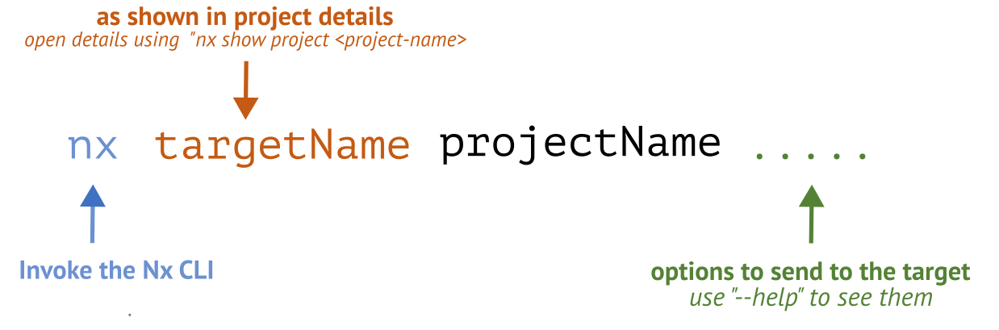

### 💻 Lab 3 - Executors

###### ⏰ &nbsp;Estimated time: 5-15 minutes

We'll build the app we just created, and look at what executors are and how to customize them.

## 📚 Learning outcomes:

- **Understand what a `target` and `executor` are**
- **Invoke executors**
- **Configure executors by passing them different options**
- **Understand how an executor can invoke another executor**

#### 📲 After this workshop, you should have:

  
App Screenshot

  

## 🏋️‍♀️ Steps:

1. Build the app

   

   
🐳 &nbsp;&nbsp;Hint

   
   
 

2. You should now have a `dist` folder - let's open it up!

   - This is your whole app's output! If we wanted to, we could push this to a server, and it would all work.
   - Notice how all files have hashes in their suffix.
   - Open one of the files, for example, `main.{hash}.js`, and look at its contents. Notice how it's minified.
      

3. Open the **Project Details** for your `store` app and expand the `build` section listed under "Targets."

   - This is a **target** that uses the [`nx:run-commands`](https://nx.dev/nx-api/nx/executors/run-commands#nxruncommands) **executor** to call `webpack-cli` to build the app.
   - Since the build target uses the [`webpack-cli`](https://webpack.js.org/api/cli/), like you would with any other webpack build, you can configure webpack using the `webpack.config.js` file in your project.

   

   
🐳 &nbsp;&nbsp;Hint

   The easiest way to open the Project Details is by using the <a href="https://nx.dev/getting-started/editor-setup">Nx Console from within VS Code or a JetBrains IDE</a>. Once installed, you can access <a href="https://nx.dev/recipes/nx-console/console-project-details">the Project Details Views in multiple ways</a> without leaving your editor.
     

   If you prefer to use the CLI, or are using an editor without Nx Console support, you can also open the project details in your browser by running `nx show project <project-name> --web`.
   
 

4. Configure license extraction during production builds

   - Explore the `webpack.config.js` file for the `store` app.
   - Remember how we copied some images into our `/assets` folder earlier? Look through the webpack config and try to find how it knows to include them in the final build!
      
   - Configure webpack to `extractLicenses` into a `3rdpartylicenses.txt` file during the build, but only when the node environment is `production`.
   

   
🐳 &nbsp;&nbsp;Hint

   The `NxAppWebpackPlugin` takes an `extractLicenses` option.

    
 

5. Build the app again

   - Notice how we now have a `3rdpartylicenses.txt` file in the `dist` folder.

6. Add a `development` configuration to the `build` target that changes the `node-env` argument to `development`.

   - Nx detects the presence of tooling configuration, in this case `webpack.config.js`, and automatically [infers targets](https://nx.dev/concepts/inferred-tasks) needed to run that tool with a set of common defaults (`build`, `preview`, `serve` in this case).
   - These targets can be modified by adding additional configuration to the `targets` key in the `project.json`.
   - Targets can have multiple configurations that allow for the execution of the same tool with different options.

   

   
🐳 &nbsp;&nbsp;Hint

   - The key you need to add to the `project.json` is `targets.build.configurations.development.args`.
   - Use the Project Details view to see how the environment is being set to production as an example.

   
 

7. Build the app one more time, but this time using the development configuration we just created.
   

   
🐳 &nbsp;&nbsp;Hint

   `--configuration=development`

   
 

8. Open up the `dist` folder again - notice how the `3rdpartylicenses.txt` file is gone, as per the "development" configuration in `project.json`. Also, notice how filenames no longer have hashed suffixes. Open one of the files, for example `main.{hash}.js`. Notice how its content is now fully readable, and there are sourcemaps attached to each of the compiled files.
    

---

🎓&nbsp;&nbsp;If you get stuck, check out [the solution](SOLUTION.md)

---

[➡️ &nbsp;Next lab ➡️](../lab3.1/LAB.md)
