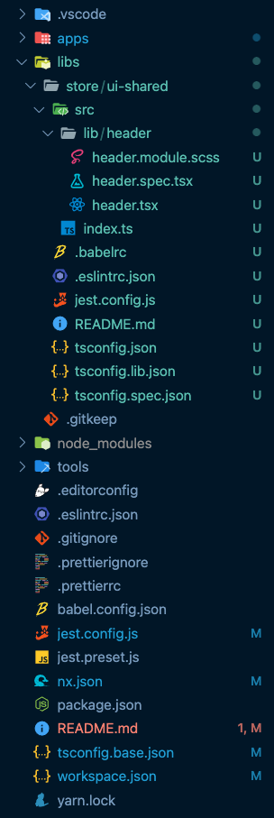

### 💻 Lab 4 - Generate a component lib

###### ⏰ &nbsp;Estimated time: 10 minutes

Let's add a header to our app! Because headers can be shared with other components, we will create a common lib that others can import as well.

## 📚 Learning outcomes:

- **Get familiar with generating project specific component libraries inside a folder**

#### 📲 After this workshop, you should have:

<details>
  <summary>App Screenshot</summary>
  
</details>

<details>
  <summary>File structure</summary>
  
</details>

## 🏋️‍♀️ Steps:

1. Stop the `nx serve`
<br/>

2. Generate a new empty React library called `ui-shared` in the `libs/store` folder

   <details>
   <summary>🐳 &nbsp;&nbsp;Hint</summary>

   - it's a generator! you've used it before in the second lab, but instead of an `app`, we now want to generate a `lib`
   - use the `--help` command to figure out how to generate it in a **directory** and that it doesn’t create default component

   </details>

3. Generate a new React component, called `header`, inside the lib you just created

   ⚠️ Play around with the generator options so that the generated component is automatically **exported** from the lib's module

   <details><summary>🐳 &nbsp;&nbsp;Hint</summary>

   use `--help` to figure out how to specify under which **project** you want to generate the new component and how to automatically have it **exported** and skip the component generation

   </details>

4. Replace the `header` component's [code](../../examples/lab4/libs/store/ui-shared/src/lib/header/header.tsx)
<br/>


5. Let's use the new shared header component we created

   - Add your new component to `apps/store/src/app/app.tsx`

    <details>
    <summary>🐳 &nbsp;&nbsp;Hint</summary>

   ```typescript
   import { Header } from '@bg-hoard/store/ui-shared';
   ```

   ```html
   <Header title="Board Game Hoard" />
   <!-- right at the top - above our container -->
   <div className="{styles.container}"></div>
   ```

   Wrap the App component in a fragment (`<>` and `</>`)

    </details>

   ⚠️ You might need to restart the TS compiler in your editor (`CTRL+SHIFT+P` in VSCode and search for `Restart Typescript`)

6. Serve the project and test the changes
<br/>

7. Run the command to inspect the dependency graph - What do you see? (Remember to "Select all" in the top left corner)
    <details>
    <summary>🐳 &nbsp;&nbsp;Hint</summary>

   ```bash
   nx dep-graph
   ```

    </details>

8. Inspect what changed from the last time you committed, then commit your changes
<br/>


---

🎓&nbsp;&nbsp;If you get stuck, check out [the solution](SOLUTION.md)

---

[➡️ &nbsp;Next lab ➡️](../lab5/LAB.md)
