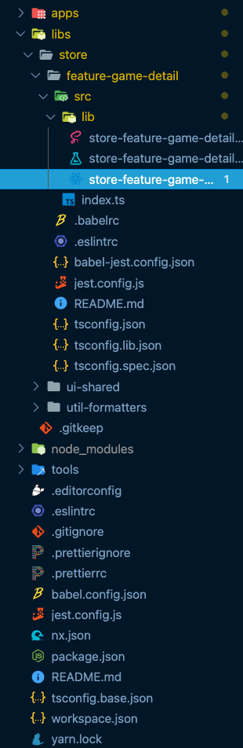

### 💻 Lab 6 - Generate a route lib

###### ⏰ &nbsp;Estimated time: 15-25 minutes

We'll look at more advanced usages of the `@nrwl/react` generators and generate a new route lib for our store application. We'll see how Nx takes care of most of the work, and we just have to do the wiring up!

## 📚 Learning outcomes:

- **Get familiar with more advanced usages of Nx generators to create a React route lib**

#### 📲 After this workshop, you should have:

<details>
  <summary>App Screenshot</summary>
  
</details>

<details>
  <summary>File structure</summary>
  
</details>

## 🏋️‍♀️ Steps:

1. Stop `nx serve`
<br/>

2. Use the `@nrwl/react:lib` generator to generate a new routing library called `feature-game-detail` that:

   - lives under `libs/store`
   - its parent routing app is `store`

   ⚠️ **Use `--help`** with the above generator to figure out which options you need to use to enable **all** the above (See the solution if still unsure)

3. Change the routing path in `apps/store/src/app/app.tsx` to pick up the game ID from the URL

    <details>
    <summary>🐳 &nbsp;&nbsp;Hint</summary>

   ```ts
   // add this to imports
   import { Route, useHistory } from 'react-router-dom';
   import { StoreFeatureGameDetail } from '@bg-hoard/store/feature-game-detail';

   // add this as a last element to container
   <Route path="/game/:id" component={StoreFeatureGameDetail} />
   ```

    </details>

4. Populate your new component with the provided files: `game-detail.`[tsx](../../examples/lab6/libs/store/feature-game-detail/src/lib/game-detail/game-detail.tsx) / [scss](../../examples/lab6/libs/store/feature-game-detail/src/lib/game-detail/game-detail.module.scss)
<br/>

5. Make clicking on each card route to the `game-detail` with the game's ID:

   <details>
   <summary>🐳 &nbsp;&nbsp;Hint</summary>

   ```ts
     // initialize the history hook
     const history = useHistory();

     // add on click to card element
     <Card
       key={x.id}
       className={styles['game-card']}
       onClick={() => history.push(`/game/${x.id}`)}
     >
   ```

    </details>

6. Serve your app again, click on some games, and compare with the screenshot above
<br/>

7. Launch the dependency graph and see what's been added
<br/>

8. Inspect what changed from the last time you committed, then commit your changes
<br/>


---

The result is still pretty simple though. Our route just displays the ID of the selected game in a card. It would be great if we had some API to get the full game from that ID!

---

🎓&nbsp;&nbsp;If you get stuck, check out [the solution](SOLUTION.md)

---

[➡️ &nbsp;Next lab ➡️](../lab7/LAB.md)
