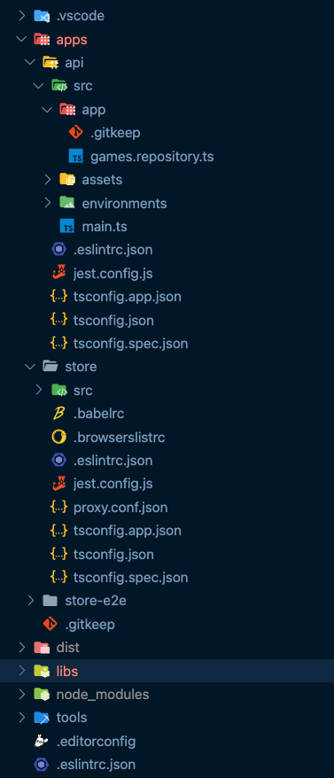

### 💻 Lab 7 - Add a NestJS API

###### ⏰ &nbsp;Estimated time: 10-15 minutes

Up until now we've had a single app in our repository, and a few other libs that it uses.

But remember how we created that `fake-api` way back in the second lab, that only our `store` app can access?

Our new routed component suddenly needs access to the games as well, so in this lab we'll be adding a completely new app, this time on the backend, as an API. And we'll use the `@nrwl/express` plugin to easily generate everything we need.

All the Express specific code for serving the games is provided in the solution.

## 📚 Learning outcomes:

- **Explore other plugins in the Nx ecosystem**

#### 📲 After this workshop, you should have:

  
App Screenshot

  No change in how the app looks!

  
File structure

  

## 🏋️‍♀️ Steps:

1. Stop any running `nx serve` instance
 

2. `yarn add @nrwl/express` or `npm i -S @nrwl/express`
 

3. Generate a new Express app, called `api`

   ⚠️ Make sure you instruct the generator to configure a proxy from the frontend `store` to the new `api` service (use `--help` to see the available options)

4. Copy the code from the `fake api` to the new file `apps/api/src/app/`[games.repository.ts](../../examples/lab7/apps/api/src/app/games.repository.ts)
 

5. Update the Express [main.ts](../../examples/lab7/apps/api/src/main.ts) to use the repository data
 

6. Let's now inspect the dependency graph!
 

7. Inspect what changed from the last time you committed, then commit your changes
 

---

🎓&nbsp;&nbsp;If you get stuck, check out [the solution](SOLUTION.md)

---

[➡️ &nbsp;Next lab ➡️](../lab8/LAB.md)
