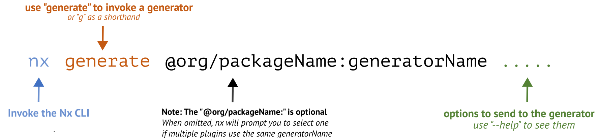

### 💻 Lab 9 - Generate a type lib that the API and frontend can share

###### ⏰  Estimated time: 15 minutes

Now our dependency graph looks a bit disconnected. The frontend and the API still do not have anything in common. The power of Nx libraries is that they can be shared among any number of projects.

We'll look at creating libs to store Typescript interfaces and then we'll use the Nx **Move** generator to move that library around our project, with minimal effort.

## 📚 Learning outcomes:

- **Explore other real-world examples of creating shared libs for a specific project**
- **Learn to use the `move` generator**

#### 📲 After this workshop, you should have:

<details>
  <summary>App Screenshot</summary>
  No change in how the app looks!
</details>

## 🏋️‍♀️ Steps:

1. Stop serving both the API and the frontend
   <br />

2. Generate a new `@nx/js` lib called `util-interface` inside the `libs/api` folder.

   ⚠️&nbsp;&nbsp;It's **important** that we create it in the `/api` folder for now
   <br />

3. Create your `Game` interface: see `libs/api/util-interface/src/lib/`[api-util-interface.ts](../../examples/lab9/libs/api/util-interface/src/lib/api-util-interface.ts)
   <br />

4. Import it in the API service: `apps/api/src/app/games.repository.ts`

   ⚠️&nbsp;&nbsp;You might need to restart the Typescript compiler in your editor

   <details>
   <summary>🐳 &nbsp;&nbsp;Hint</summary>

   ```typescript
   import { Game } from '@bg-hoard/api/util-interface';
   const games: Game[] = [...];
   ```

   </details><br />

5. Build the API and make sure there are no errors

   <details>
   <summary>🐳 &nbsp;&nbsp;Hint</summary>

   ```shell
   nx build api
   ```

   </details><br />

6. Inspect the dependency graph
   <br />

7. Make sure to commit everything before proceeding!
   <br />

---

Our frontend store keeps a list of `Game`s in state:

```typescript
const [state, setState] = useState<{
  data: any[];
  loadingState: 'success' | 'error' | 'loading';
}>({
  data: [],
  loadingState: 'success',
});
```

But it's currently typed to `any` - so our component has no idea about the shape of the objects it uses!

Let's fix that - we already have a `Game` interface in a lib. But it's nested in the `api` folder - we need to move it out to the root `libs/` folder so any project can use it!

---

8.  Use the `@nx/workspace:move` generator to move the interface lib created above into the root `/libs` folder

    ⚠️&nbsp;&nbsp;Make sure you use the `--dry-run` flag until you're confident your command is correct

    <details>
    <summary>🐳 &nbsp;&nbsp;Hint 1</summary>
    
    </details>

    <details>
    <summary>🐳 &nbsp;&nbsp;Hint 2</summary>

    Use the `--help` command to figure out how to target a specific **project**
    Alternatively, check out the [docs](https://nx.dev/latest/react/react/move#move)

    </details>

    <details>

    <summary>🐳 &nbsp;&nbsp;Hint 3</summary>

    Your library name is `api-util-interface` - to move it to root, its new name needs to be `util-interface`

    </details><br />

9.  We can now import it in the frontend components and use it when making the `http` request:

        <details>
        <summary>🐳 &nbsp;&nbsp;Hint</summary>

        Frontend store shell app: `apps/store/src/app/app.tsx`

        ```typescript
        import { Game } from '@bg-hoard/util-interface';

        const [state, setState] = useState<{
          data: Game[];
          loadingState: 'success' | 'error' | 'loading';
        }>({
          data: [],
          loadingState: 'success',
        });
        ```

        ***

        Routed game detail component: `libs/store/feature-game-detail/src/lib/game-detail/game-detail.tsx`

        ```typescript
        const [state, setState] = useState<{
          data: Partial<Game>;
          loadingState: 'success' | 'error' | 'loading';
        }>({
          data: {},
          loadingState: 'success',
        });
        ```

        </details>

        ⚠️&nbsp;&nbsp;Notice how we didn't have to update the imports in the API. The `move` generator took care of that for us!

    <br />

10. Trigger a build of both the store and the API projects and make sure it passes
    <br />

11. Inspect the dependency graph
    <br />

12. Inspect what changed from the last time you committed, then commit your changes
    <br />

---

🎓&nbsp;&nbsp;If you get stuck, check out [the solution](SOLUTION.md)

---

[➡️ &nbsp;Next lab ➡️](../lab10/LAB.md)
